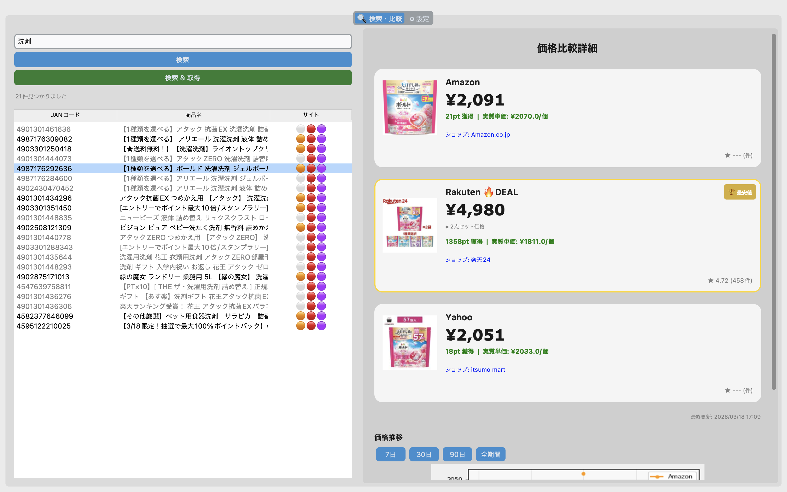
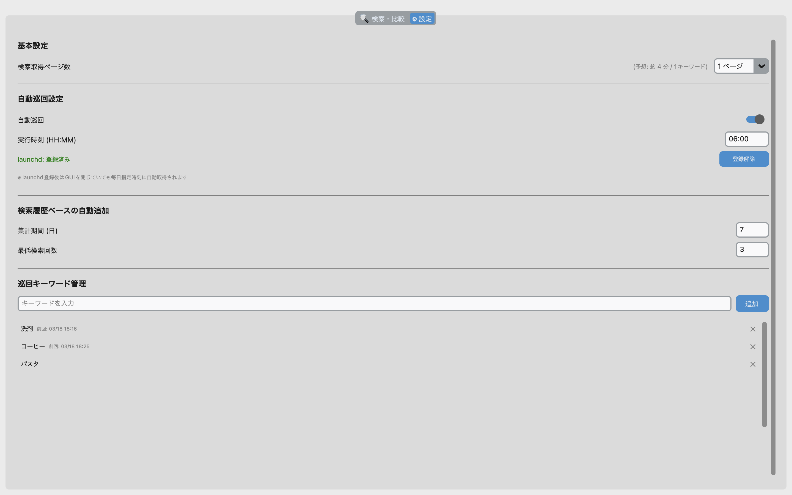

# EC価格比較ツール

Amazon・楽天市場・Yahoo!ショッピングを横断し、ポイント・送料を加味した**実質最安値**を自動算出・比較するデスクトップアプリです。

👉 **価格調査・仕入れ判断・競合分析を効率化します。**


---

## 解決できる課題

- 複数ECサイトの価格調査に時間がかかる
- 手動では価格変動を追いきれない
- CSVでは分析が面倒で意思決定に使いづらい

---

## 提供価値

- **3サイト横断の価格比較を自動化**
- **価格履歴を蓄積し、推移をグラフで可視化**
- **定期取得により価格変動を継続的に把握**
- **非エンジニアでも使えるGUI＋アプリ形式**

---

## 特徴（他ツールとの差別化）

- 単発取得ではなく**価格履歴を蓄積**
- **GUI上で価格推移を可視化**
- **アプリとして配布（Python環境不要）**
- APIとスクレイピングを組み合わせた**高精度データ取得**
- **定期実行により手動操作なしでデータを蓄積可能**

---

## 利用イメージ

- EC商品の仕入れ判断
- 価格差の把握
- 競合価格の継続的な確認
- セール・値下げタイミングの分析

---

## 主な機能

- **3サイト横断価格比較** — Amazon・楽天・Yahoo!の価格を1画面で比較
- **実質単価の算出** — 送料・ポイント還元・数量を考慮した実質単価を計算
- **JANコードによる名寄せ** — 楽天で取得したJANコードを起点にAmazon・Yahoo!の同一商品を特定
- **価格推移グラフ** — 7日・30日・90日・全期間の価格推移を可視化
- **自動巡回スケジューラ** — launchd（macOS）を使い、GUIを閉じていても毎日指定時刻に自動取得
- **検索履歴ベースの自動追加** — 過去N日間で頻繁に検索されたキーワードを自動で巡回対象に追加

---

## スクリーンショット




---

## 動作環境

- macOS（launchdによる自動巡回機能を使用する場合）
- Python 3.10 以上

---

## ダウンロードして使う場合（macOS）

### zipの内容
```
EC価格比較ツール/
├── EC価格比較ツール.app    # アプリ本体
└── .env.example          # 環境変数の設定例
```

### セットアップ手順

1. [Releases](https://github.com/Haru8-8/ec-price-comparison/releases) から最新版のzipをダウンロード
2. zipを展開する
3. `.env.example` を `.env` にコピーしてYahoo! App IDを設定
4. `EC価格比較ツール.app` をダブルクリックして起動

> - MacのFinderでは `.` で始まるファイルが非表示になる場合があります。`Command + Shift + .` で表示/非表示を切り替えられます。
> - 初回起動時にmacOSのセキュリティ警告が出た場合は、Finderで右クリック→「開く」を選択してください。

### 初回起動後のファイル構成

初回起動後、アプリと同じフォルダに以下のファイルが自動生成されます。

```
EC価格比較ツール/
├── EC価格比較ツール.app
├── .env.example
├── .env                  # 自分で作成した環境変数ファイル
├── ec_tools.db           # 価格データベース（自動生成）
├── config.json           # アプリ設定（自動生成）
├── scheduler.log         # 自動巡回ログ（自動巡回有効時に自動生成）
└── scheduler_error.log   # エラーログ（自動巡回有効時に自動生成）
```

---

## セットアップ（開発環境）

### 1. リポジトリをクローン

```bash
git clone https://github.com/Haru8-8/ec-price-comparison.git
cd ec-price-comparison
```

### 2. 仮想環境の作成と依存パッケージのインストール

```bash
python -m venv .venv
source .venv/bin/activate
pip install -r requirements.txt
```

### 3. 環境変数の設定

`.env.example` をコピーして `.env` を作成し、APIキーを設定します。

```bash
cp .env.example .env
```

`.env` の内容：

```
YAHOO_CLIENT_ID=your_id_here
DB_NAME=your_favorite_db_name
```

Yahoo!ショッピングのApp IDは [Yahoo! JAPAN Developers](https://developer.yahoo.co.jp/) から取得してください。

### 4. GUIの起動

```bash
python app.py
```

### 5. アプリとして起動する場合（macOS）

```bash
bash build_app.sh
```

`dist/` フォルダに `EC価格比較ツール.app` が生成されます。ダブルクリックで起動できます。

---

## 使い方

### 価格比較

1. 左ペインの検索窓にキーワードまたはJANコードを入力して「検索」
2. 検索結果一覧から商品を選択すると右ペインに3サイトの価格比較が表示される
3. 「🔄 データ取得」ボタンで最新価格を取得

サイトアイコンの見方：
- 🟠 Amazon取得済み
- 🔴 楽天取得済み
- 🟣 Yahoo!取得済み
- ⚪ 未取得

### 自動巡回の設定

「⚙ 設定」タブから以下を設定できます。

| 項目 | 説明 |
|------|------|
| 自動巡回 ON/OFF | 自動取得の有効・無効を切り替え |
| 実行時刻 | 毎日の取得時刻（例: `08:00`） |
| launchd登録 | macOSの常駐デーモンとして登録・解除 |
| 集計期間 | 検索履歴の集計対象期間（日数） |
| 最低検索回数 | 自動追加の閾値（N回以上検索されたキーワードを追加） |
| 巡回キーワード管理 | 手動でキーワードを追加・削除 |

> - **PCのスリープについて**: launchdの仕様上、Macが完全にシャットダウンされている場合は実行されませんが、スリープ中であれば復帰時に実行されるよう設定されています。
> - **アプリの終了**: 設定後にGUIアプリを終了させても、指定時刻にバックグラウンドで取得処理が走り、次回アプリ起動時に最新データが反映されます。

---

## ディレクトリ構造

```
ec-price-comparison/
├── app.py                  # エントリーポイント
├── main.py                 # スクレイピングパイプライン
├── scheduler.py            # 自動巡回スクリプト（launchd用）
├── config.py               # 設定管理（.env / config.json）
├── build_app.sh            # PyInstallerビルドスクリプト
├── gui/
│   └── gui_manager.py      # GUIアプリ本体
├── scrapers/
│   ├── base.py             # スクレイパー基底クラス
│   ├── amazon.py           # Amazonスクレイパー
│   ├── rakuten.py          # 楽天スクレイパー
│   └── yahoo.py            # Yahoo!ショッピングスクレイパー（API）
├── db/
│   └── db_manager.py       # DBアクセス層（SQLite）
├── services/
│   ├── search_engine.py    # 商品検索
│   ├── price_comparison.py # 価格比較・履歴取得
│   └── normalize_to_gtin.py # JANコード正規化
├── requirements.txt
├── .env.example
├── README.md
└── docs/
    └── screenshots/
        ├── comparison.png
        └── settings.png
```

---

## 技術スタック

| 分類 | 技術 |
|------|------|
| GUI | CustomTkinter |
| スクレイピング | Requests + BeautifulSoup4 + lxml |
| Yahoo! API | Yahoo!ショッピング 商品検索API V3 |
| DB | SQLite3 |
| グラフ | Matplotlib |
| 自動実行 | launchd（macOS） |
| 画像処理 | Pillow |
| アプリ化 | PyInstaller |

---

## データベース設計

```
products           商品マスタ（JANコードで名寄せ）
site_products      サイト別商品ページ（ASIN / shopId_itemId / code）
price_history      価格履歴（取得のたびに追記）
sites              サイトマスタ
scheduled_keywords 巡回キーワード（手動登録）
search_history     検索履歴（GUI操作から自動記録）
```

---

## 技術的な工夫

### JANコードによる横断名寄せ
楽天・Amazon・Yahoo!はそれぞれ独自の商品ID（楽天: shopId_itemId、Amazon: ASIN、Yahoo!: code）を持つため、同一商品の特定にJANコード（GTIN-13）を共通キーとして使用しています。楽天の詳細ページからJANを取得し、それを起点にAmazonのASINを逆引き検索、Yahoo!ショッピングAPIではJANコード直接検索を行っています。

### 実質単価の算出
単純な価格比較ではなく「送料込み・ポイント引き・数量割り」の実質単価を算出しています。セット商品の数量抽出には正規表現パターンマッチングを使用し、内容量（粒数・枚数）と購入単位（袋数・本数）を区別する工夫をしています。

### Amazonの価格取得フォールバック
「おすすめ出品なし」の商品は通常ページに価格が表示されないため、`/gp/product/ajax/aodAjaxMain` エンドポイントへのフォールバックを実装し、出品者一覧から価格と送料を取得しています。

### GUIの安定性
tkinterはスレッドセーフでないため、スクレイピング中のUI操作によるSegmentationFaultを防ぐためにキューベースのスレッド間通信を実装しています。スクレイピング中は操作を無効化し、完了後にキューへ通知することでメインスレッドのみがUIを操作する設計にしています。

### launchdによる常駐不要のスケジューリング
自動巡回にはmacOS標準のlaunchdを使用しています。常駐プロセス方式ではなく、指定時刻にスクリプトを起動して処理完了後に終了する方式を採用しているため、実行中以外はメモリを消費しません。GUIからの時刻変更は `launchctl unload/load` を介してplistに即座に反映されます。

### macOS向けのパス解決
PyInstallerで .app 化した際、macOS特有のバンドル構造（`.app/Contents/MacOS/`）によって相対パスが崩れる問題を解決するため、`sys.executable` から `.app` バンドルの親ディレクトリを動的に特定する処理を実装しています。これにより、アプリをどのフォルダに移動させても `.env` や DBファイルを正確に参照できます。

---

## 注意事項

- Amazon・楽天のスクレイピングは各サービスの利用規約に従って個人学習目的でご利用ください
- Yahoo!ショッピングはAPIを使用しています
- 短時間での大量アクセスはお控えください
- 本ツールの利用により生じた損害、または各ECサイトの利用規約違反によるアカウント停止等のトラブルについて、開発者は一切の責任を負いません。

---

## ライセンス

MIT License